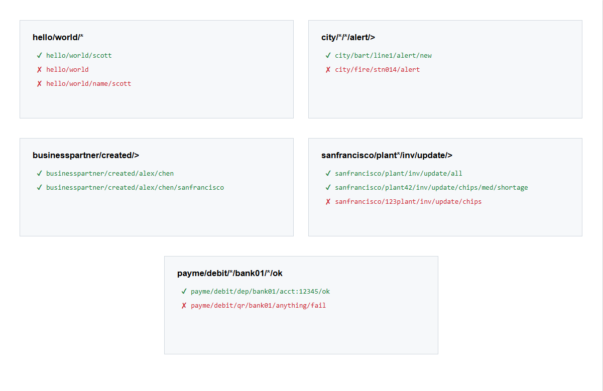
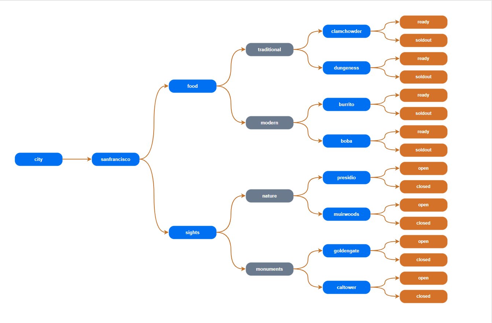

# Exercise 2 - Explore Topic Hierarchies and Wildcards

After completing these steps you will have learned about <b>topic hierarchies and wildcards</b> and how to use them.

## Exercise 2.1 Learn about Topic Hierarchies and Wildcards

Advanced Event Mesh supports a hierarchical topic structure, which means you can be very descriptive in defining your topic. Use it to describe the <b>contents/intent of your message payload data</b>.

<b>No need to use flat, coarse-grained topic labels like other brokers.</b>

### Topics

Check out this seven minute video for more information, if wanted: [All about AEM Topics](https://www.youtube.com/watch?v=PP1nNlgERQI)

Each and every message can be published to a unique topic, depending on the event metadata. Some examples of valid AEM topics are:

- hello/world/aem
- acme/taxi/rider/hail
- city/train/1234/alert/stopped
- mfg/plant42/inv/update/p12345667
- payme/debit/qr/bank01/f89a09-2b9c065a3/ok

Or for events originating from SAP S/4HANA:

- ce/sap/s4/beh/salesorder/v1/SalesOrder/Changed/v1
- ce/sap/s4/beh/businesspartner/v1/BusinessPartner/Created/v1
- ce/sap/s4/beh/workcenter/v1/WorkCenter/Created/v1

### Subscription Wildcards

Because published topics can be so variable and dynamic, subscribers can use wildcards to match a single subscription to multiple published topics. AEM supports two different types of wildcards:

- <b>Single-level wildcard</b>, 0-or-more chars, matches up to the next level `/`.
  - Can be used with a prefix e.g.: `abc*`, but not a suffix.
- <b>Multi-level wildcard</b>, matches one-or-more levels.
  - Must occur at the end of the topic subscription.

Some examples of AEM topic subscriptions, and topics that they match:



---

## Exercise 2.2 Practice Topic Hierarchies and Wildcards using Try Me!

Now that we have learned about topic hierarchies and have a great tool like Try Me! at hand — let's play around with topic hierarchies.


For this exercise, we will use **San Francisco topics** — giving you the chance to learn about topic hierarchies and the city at the same time.

1. Go to the **Try Me!** tab in the AEM broker console (same as Exercise 1).

2. Connect both Publisher and Subscriber using the broker URL you copied above.

   - Paste the **WSS URL** into the **Broker URL** field
   - Enter your **Username** and **Password**
   - Click the **Connect** button under both Publisher and Subscriber

   > Note: You may still be connected from Exercise 1 — if so, you can skip this step.

3. Clean up your Subscribed Topics so that you are not subscribing to any topics any more.


4. Check out the hierarchical categorization of <b>San Francisco-related</b> topics below.



Now try out different combinations of publishing to a topic and listening to a topic and see which events you receive.

> **Note:** There are two options for you to do the steps described below. If you all publish to the same topic, others will receive your event as well — which is exactly the concept of topics at work!
>
> Maybe think about adding a message if you want others to read the event — something like *"I like clam chowder!"* while sending it to the clam chowder topic could make sense 😊
>
> If you want to play around just for yourself, add your number to the topic at the beginning. Make sure you add it when subscribing as well.
>
> Instead of:
> `city/sanfrancisco/food/traditional/clam_chowder/ready`
>
> publish to or subscribe to:
> `XXX/city/sanfrancisco/food/traditional/clam_chowder/ready`
>
> where you replace `XXX` with your participant number.

5. Register the consumer to listen to the clam chowder topic — we just want to learn about clam chowder being ready.

   Subscribe the consumer to the topic: <b>city/sanfrancisco/food/traditional/clam_chowder/*</b>


6. Send a `clam_chowder.ready` event to the topic <b>city/sanfrancisco/food/traditional/clam_chowder/ready</b>

   Go to the Publisher, add a payload to the message field (e.g. *a bowl of clam chowder for Scott*), put <b>city/sanfrancisco/food/traditional/clam_chowder/ready</b> into the topic field and click **Publish**.

   If you want to add your own payload, or just copy this one:

   ```
   Customer: Scott
   Price: $5
   ```


   You should receive the message.


7. Now we want to learn about all sights being open.

   - Go to the Subscriber
   - Delete the topics you are currently listening to


   - Subscribe to `city/sanfrancisco/sights/*/*/open`


   - Send a `golden_gate.open` event via <b>city/sanfrancisco/sights/monuments/golden_gate/open</b>

   If you want to, add your own payload. Alternatively just copy this one:

   ```
   Location: Marina District
   Status: Open
   ```


8. Try out a few combinations on your own and see what works and what does not.

   To make this easier, here are all the topics which you can use to simply copy and paste:

   **Sights — Monuments:**
   - `city/sanfrancisco/sights/monuments/golden_gate/open`
   - `city/sanfrancisco/sights/monuments/golden_gate/closed`
   - `city/sanfrancisco/sights/monuments/alcatraz/open`
   - `city/sanfrancisco/sights/monuments/alcatraz/closed`

   **Sights — Nature:**
   - `city/sanfrancisco/sights/nature/golden_gate_park/open`
   - `city/sanfrancisco/sights/nature/golden_gate_park/closed`
   - `city/sanfrancisco/sights/nature/ocean_beach/open`
   - `city/sanfrancisco/sights/nature/ocean_beach/closed`

   **Food — Traditional:**
   - `city/sanfrancisco/food/traditional/clam_chowder/ready`
   - `city/sanfrancisco/food/traditional/clam_chowder/soldout`
   - `city/sanfrancisco/food/traditional/sourdough/ready`
   - `city/sanfrancisco/food/traditional/sourdough/soldout`

   **Food — Modern:**
   - `city/sanfrancisco/food/modern/fish_tacos/ready`
   - `city/sanfrancisco/food/modern/fish_tacos/soldout`
   - `city/sanfrancisco/food/modern/burrito/ready`
   - `city/sanfrancisco/food/modern/burrito/soldout`

---

## Summary

You've now explored topic hierarchies and wildcards.

Continue to - [Exercise 3 - Persistent and Non-Persistent Quality of Service](../ex3/README.md)
